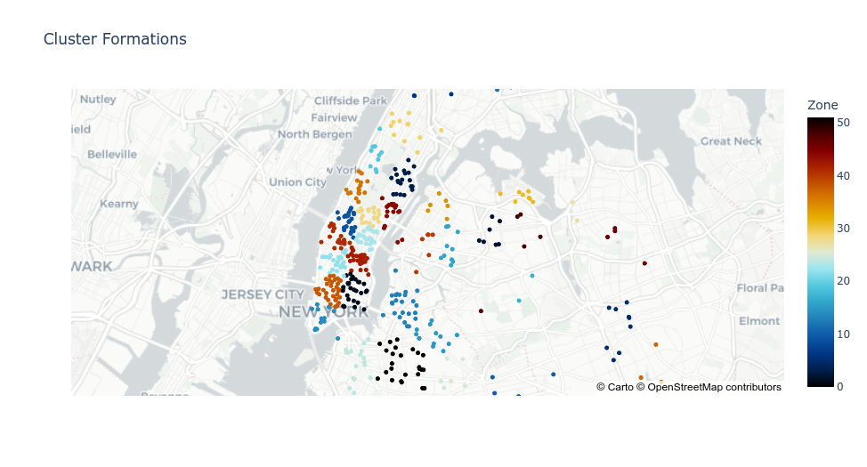
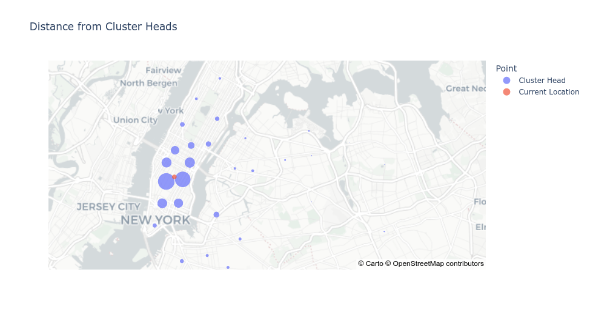

# Taxi-Cab-Position-Allocator

## Description
    A machine learning based approach to assist cab drivers to find the most optimal position with respect to their current location for getting a customer

## Problem Statement
    The existing system of cab service is inefficient doesn’t have any system to position the cabs. Commuters have to wait for a very long time for a cab if all the nearby cabs are already taken. This system will help in improving customer satisfaction and also provide higher profits for cab services. Furthermore this idea could be advanced upon to make a more intelligent system which will analyse the traffic(customer) and it’s movement to deploy each cab in a more efficient and economic way.

## How to run the code
    - Clone the repository
    - Run the following commands
        + `virtualenv venv`
        + `source venv/bin/activate`
        + `pip install -r requiremnts.txt`
        + `jupyter notebook`
    - Execute all the code cells to run the program

## Output
    - Code input/output text
        
    - Gives a scatter plot representation of the cab positions based on the input data 
        
    - Gives a concise interpretation of the scatter plot with the varying sizes of the cluster heads indicating the utility(based on distance from current position and density of the cluter) value of the position
        